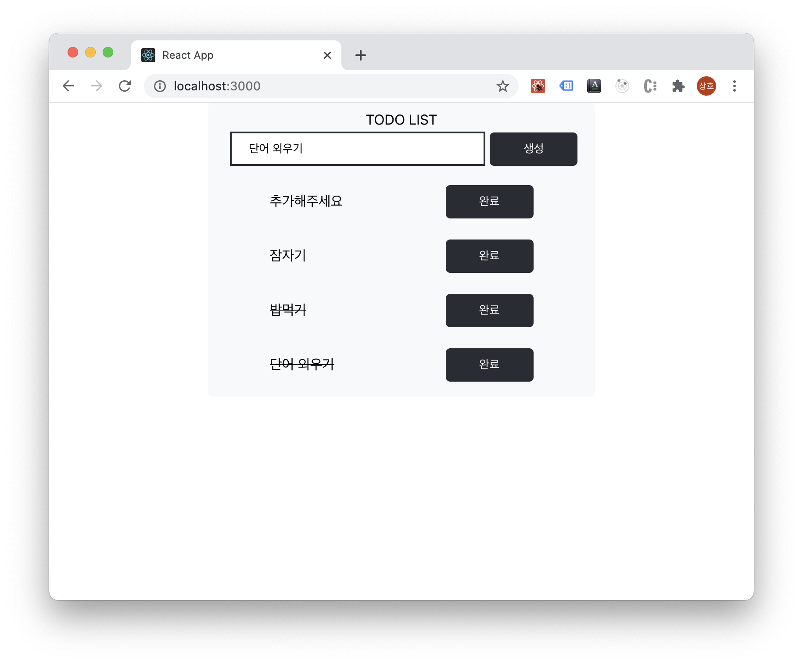

# TodoList
simple todo list.

###`react`

###`typescript`

###`recoil`

###`storybook`

###`hygen`

## Available Scripts

### `yarn start`

로컬 서버: [http://localhost:3000](http://localhost:3000)

### `yarn build`

build 폴더 생성

### `yarn storybook`

storybook 실행: [http://localhost:9009](http://localhost:9009)

### `hygen components container/foundation/page [componentName]`

hygen 을 이용하여 skeleton code 자동 생성

